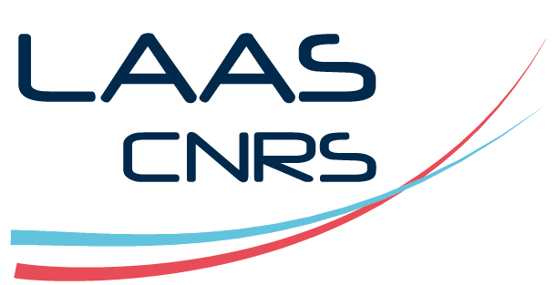
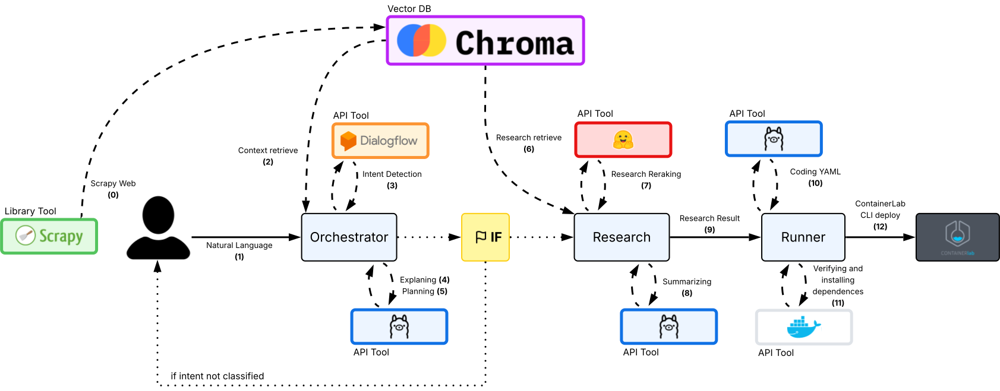
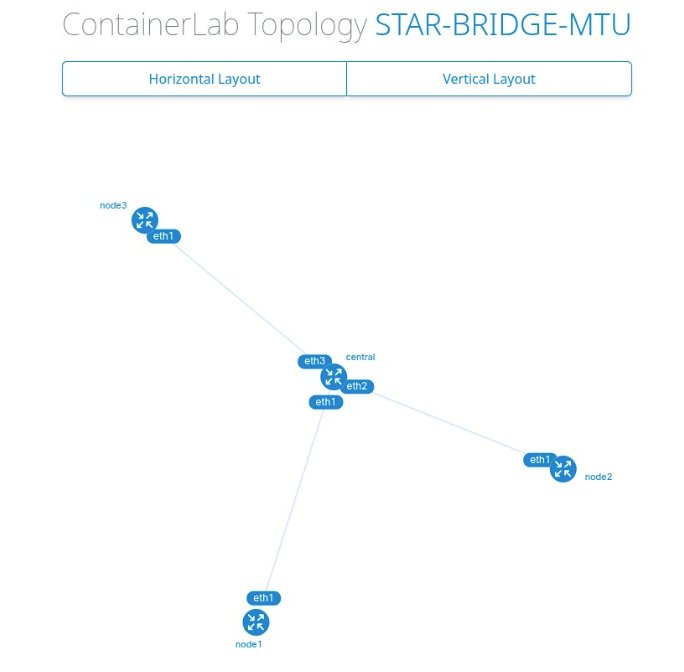

<br></br>

# Intent-Based Network Agent (Clab Agent)


Artificial Intelligence for Intent-Based Network Modeling with ContainerLab

*Intelligent agent system developed at LAAS-CNRS to automate the generation and deployment of network topologies from natural language.*

### 👨‍🎓 Auteur
Nathan dos Reis Ruba \
Student-Engineer in Automation-Electronics Embedded Systems \
<b>Spécialisation :</b> Cybersecurity (M2 TLS-SEC)

📍 INSA Toulouse - Institut National des Sciences Appliquées

✉️ Email : nathan.ruba2003@gmail.com \
🔗 LinkedIn : [Nathan dos Reis Ruba](https://www.linkedin.com/in/nathan-dos-reis-ruba-1062b7145/)


## 🎓 Contexte Académique
This project was developed as part of a 3-month internship at LAAS-CNRS (Laboratory of Analysis and Architecture of Systems) in Toulouse, France.

### 🏛️ Instituition
- Engineering school: INSA Toulouse
- Laboratory: LAAS-CNRS, Toulouse
- Team: Services and Architectures for Advanced Networks (SARA)
- Année: 2025

## 📦 Installation

### 1. System Prerequisites
- <b>Operating System:</b> Linux Distro (Ubuntu recommended)


```bash
# ContainerLab
sudo bash -c "$(curl -sL https://get.containerlab.dev)"

# Ollama for local LLMs
curl -fsSL https://ollama.com/install.sh | sh

# Required models
ollama pull qwen3:latest
ollama pull qwen2.5:3b  
ollama pull qwen2.5-coder:3b
```

### 2. Python Environment
```bash
# Clone the project
git clone https://github.com/Ruba008/clab_agent.git
cd clab_agent

# Virtual environment
conda create -n clab_agent python=3.11.13
conda activate clab_agent

# Dependencies
pip install -r requirements.txt
```

### 3. Google Cloud Configuration
```bash
# Authentication for Dialogflow
export GOOGLE_APPLICATION_CREDENTIALS="/path/to/credentials.json"
```

### 4. Import DialogFlow Project
Go to `src/intent_classifier.zip` and import the files to [DialogFlow](https://dialogflow.cloud.google.com/).

### 5. IMPORTANT: configure the DialogFlow
Open `src/tools/models.py` and set:

```python
 # Google Cloud project configuration
    PROJECT_ID = "" # Dialogflow project ID
    SESSION_ID = "" # Static session for consistent context
    LANG = "en" # Language code for input processing
```


## 📚 Technical Documentation

### Scrapy

For scrapy the ContainerLab documentation you need to access `src` and execute `scrapy runspider ./tools/scrapy_documentation.py`.

### Project Structure
```
clab_agent/
├── src/
│   ├── main.py                 # Main entry point
│   ├── nodes/
│   │   ├── orchestrator.py     # Orchestration module
│   │   ├── researcher.py       # Research module
│   │   ├── runner.py          # Execution module
│   │   ├── schema.py          # Pydantic models
│   │   └── instructions/      # LLM prompts
│   └── tools/
│       ├── db.py              # ChromaDB interface
│       ├── models.py          # LLM management
│       └── scrapy_documentation.py
├── requirements.txt           # Python dependencies
└── README.md                 # Documentation
```
### Project Diagram
<br></br>

<br></br>
<br></br>
- <b>Orchestrator :</b> module responsible for interpreting, explaining, identifying and planning the user's objective.
- <b>Research :</b> module responsible for consuming up-to-date data from the database, ranking the best information and summarizing it.
- <b>Runner :</b> module responsible for coding, checking runtime dependencies and performing the deployment.

### Technologies Used
#### Artificial Intelligence

- 🦙 Ollama : Local LLM server (Qwen 3, Qwen 2.5, Qwen 2.5-Coder)
- 🌐 Google Dialogflow : Intent classification
- 🔗 LangChain : LLM chain orchestration
- 📊 Sentence Transformers : Cross-domain semantic encoders

#### Base de Données & Recherche

- 🎨 ChromaDB : Vector database for semantic search
- 🤗 Hugging Face : Embedding models (all-MiniLM-L6-v2)
- 📄 Scrapy : Document extraction framework

#### Orchestration & Graphes

- 🔄 LangGraph : State graphs for complex workflows
- 📐 StateGraph : Management of transitions and dependencies
- 🎯 Pydantic : Schema validation and data models

#### Conteneurisation & Réseau

- 🐳 Docker API : Programmatic container management
- 🧪 ContainerLab : Network topology deployment

#### Interface & Visualisation

- 🎨 Rich Console : Advanced terminal user interface
- 📊 Web Visualization : Interactive topology graphs (clab graph)
- ⚡ Live Updates : Real-time feedback of the AI process

## Résultats

<b>Validated Use Cases:</b>
"Create a network star topology connected with 10 Mbps maximum"

### YAML Output
```yaml
name: star-bridge-mtu
mgmt:
  network: clab
  ipv4-subnet: 172.20.20.0/24
topology:
  nodes:
    central:
      kind: linux
      image: alpine:latest
      mgmt-ipv4: 172.20.20.11
    node1:
      kind: linux
      image: alpine:latest
      mgmt-ipv4: 172.20.20.12
    node2:
      kind: linux
      image: alpine:latest
      mgmt-ipv4: 172.20.20.13
    node3:
      kind: linux
      image: alpine:latest
      mgmt-ipv4: 172.20.20.14
  links:
    - endpoints: ["central:eth1", "node1:eth1"]
      mtu: 1500
    - endpoints: ["central:eth2", "node2:eth1"]
      mtu: 1500
    - endpoints: ["central:eth3", "node3:eth1"]
      mtu: 1500
```
### Clab Graph


### Clab Inspect
| Name | Kind/Image | State | IPv4/6 Address |
| ----------- | ----------- | ----------- | ----------- |
| clab_star-bridge-mtu-central | linux alpine:latest | created | N/A |
| clab_star-bridge-mtu-node1 | linux alpine:latest | created | N/A |
| clab_star-bridge-mtu-node2 | linux alpine:latest | created | N/A |
| clab_star-bridge-mtu-node3 | linux alpine:latest | created | N/A |

## 🙏 Acknowledgements

- <b>LAAS-CNRS : </b> For the welcome and research resources.
- <b>Supervisors : </b> Pascal Berthou and Slim Abdellatif.